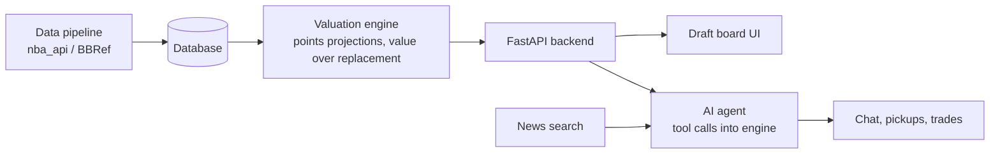

# Fantasy Basketball AI Assistant — Design Doc

Living version (edit and comment here, then sync this file): https://claude.ai/code/artifact/846efd64-3add-4c8c-86f6-7defe4274589

## Overview

We're building an AI assistant that helps fantasy basketball managers draft, pick up players, and evaluate trades. A deterministic stats engine does the math; an LLM agent reasons over its output and explains recommendations in plain language.

Primary user: us and our league-mates. Target: usable for our Oct 1 draft, with pickups and trades added during the season.

## Goals and scope

The MVP is a draft assistant for our league, usable in the real draft on Oct 1.

**MVP (in scope)**

- Player valuation for Yahoo points leagues: projected fantasy points per game, games played, and value over replacement
- Draft board: mark players as drafted, see best available for our roster
- Pick recommendation computed by the engine, explained by the LLM in one call
- Manual league setup (no platform login yet)

**Next (after MVP)**

- Pickup analyzer: agent scans free agents against roster needs, minutes trends, schedule, and news
- Trade analyzer: projected fantasy points impact of a proposed trade
- League sync via the Yahoo Fantasy API
- Daily proactive agent that alerts only when a move is worth making

**Non-goals for now**

- Multi-agent orchestration
- Category leagues and other platforms (after points works)
- Mobile app

## Open decisions

- [x] Platform: Yahoo
- [x] Scoring format: points
- [x] Point values per stat: Yahoo defaults
- [x] League: 10 teams, 13 roster spots + 2 IL, 3 flexible spots (confirm: bench or UTIL?)
- [x] Draft: Oct 1, 8pm PT
- [ ] Data source: `nba_api` (default unless we pick otherwise)
- [x] LLM for the agent layer: Claude API
- [x] Frontend: Streamlit for the October draft, React later

## Architecture

Code does the math; the LLM decides and explains. The draft pick path is deterministic for speed; pickups and chat are agentic.

The agent calls engine functions as tools and loops until it can answer. During a live draft, the engine picks and the LLM only writes the explanation. For the MVP, Streamlit calls the engine directly; the FastAPI layer comes after the draft.

**Repo layout**

- `engine/` data pipeline, valuation, projections, backtests
- `app/` API, agent, prompts, UI
- `docs/` this design doc and the decision log
- `CLAUDE.md` shared context for both of our Claude sessions

## Interface contract

These functions are the boundary between the engine and the app. Changing a signature means updating this table in the same pull request.

| Function | Input | Returns | MVP? |
| --- | --- | --- | --- |
| `get_player_values` | league settings (point values per stat) | ranked players with projected fantasy points per game and value over replacement | Yes |
| `recommend_pick` | draft state (players taken), our roster, league settings | top N picks with value and roster-fit reasons (positions, games played) | Yes |
| `get_player_profile` | player id | season and recent stats, minutes trend, injury status | Yes |
| `find_pickups` | our roster, free agents, week | ranked pickups with reasons (need fit, minutes trend, games this week) | No |
| `evaluate_trade` | players out, players in, our roster | projected rest-of-season fantasy points before vs after | No |

**Shared data objects to define:** `LeagueSettings`, `Player`, `DraftState`, `Roster`. Until the engine is ready, the app uses mock versions that return the same shapes.

## Pickup analyzer design (after draft)

Pickups combine many factors. Measurable factors are scored by the engine; factors that need reading and judgment are handled by the Claude agent.

**Engine factors (Mahir)**

| Factor | What it captures | Data source |
| --- | --- | --- |
| Recent production | Fantasy points per game over last 7 and 14 days vs season average | `nba_api` game logs |
| Minutes and usage trend | Whether a player's role is growing | `nba_api` |
| Schedule | Games this week and over the next few weeks | `nba_api` schedule |
| Availability history | Share of games played over the last 2–3 seasons, used as an injury-risk discount | `nba_api` |
| Teammate dependency | Minutes and fantasy points with vs without a key teammate playing | `nba_api` game logs |
| Roster fit | Net gain vs the worst player on our roster | Our roster + engine values |
| Rostered % trend | Whether other managers are adding him | Yahoo API |

**Agent factors (Claude API with web search)**

- Current injury status and return timelines
- Teammate injuries that open up minutes
- Teammates returning from injury, which can shrink a pickup's role
- Injured players close to returning, as IL stash candidates (we have 2 IL slots)
- Role changes: trades, lineup changes, coach comments
- Rest patterns such as sitting out back-to-backs

**Flow**

1. Engine scores every free agent: projected points over the next N games, discounted by injury risk, minus the player we'd drop.
2. Agent takes the top 10–15 candidates and searches news for each player and their team's injuries.
3. Agent flags what the numbers miss (for example, a starter returning soon) and explains final picks, stating its confidence when return timelines are vague.

**Notes**

- Factor weights come from testing against last season's data, not guesses. Short hot streaks often fade; minutes trends usually matter more.
- Teammate dependency needs enough games in each situation to be reliable; very small splits are mostly noise.
- The same checks apply to our own roster, to flag players whose role depends on an injured starter.
- Availability history is also useful before Oct 1, to discount injury-prone players in draft rankings.
  
## Ownership and workflow

| Area | Owner |
| --- | --- |
| Data pipeline, database | Mahir Krishnan (data science) |
| Valuation model: points projections, value over replacement | Mahir |
| Backtesting draft recommendations | Mahir |
| AI agent: tools, prompts, reasoning | Varun |
| UI and UX (draft board, chat) | Varun |
| FastAPI backend, league integration | Varun |
| Interface contract, this doc | Both |

**How we stay in sync**

- The GitHub repo is the source of truth; nothing important lives only in a chat window.
- `CLAUDE.md` gives both of our Claude sessions the same project context.
- Tasks live in GitHub Issues with one owner each; work on branches, merge via pull requests the other person skims.
- Group chat for quick questions; one weekly call to demo progress and pick next tasks.
- Contract changes get flagged in the PR title.

## Milestones

The draft is Oct 1 at 8pm PT, eight days out, so the MVP is a one-week sprint. The rankings file is the fallback: if the app isn't ready, it still works as a cheat sheet.

| Dates | Mahir | Varun |
| --- | --- | --- |
| Sep 24–25 | Pull last season's stats with `nba_api`; compute Yahoo fantasy points per game and games played | Streamlit draft board on mock data: mark players drafted, track our roster |
| Sep 26–27 | Projections for this season + value over replacement for 10 teams; export rankings CSV | Load real rankings; best-available view filtered by open roster slots |
| Sep 28–29 | Sanity-check rankings (rookies, injuries, role changes) | Claude API explanation for top picks (stretch if time is short) |
| Sep 30 | Fixes from a Yahoo mock draft run together | Fixes from the mock draft; freeze the app |
| Oct 1 | Draft night | Draft night |
| After draft | Backtesting, minutes-trend model, `find_pickups` | FastAPI backend, pickup agent, news tool |

## Decision log

| Decision | Why |
| --- | --- |
| Single agent with tools, not multi-agent | One agent with good tools is simpler and enough for these tasks |
| Draft pick is deterministic; LLM only explains | Speed and predictability under a pick clock |
| Build the draft assistant first | Draft season is October; pickups and trades reuse the same engine |
| Repo is the source of truth, with `CLAUDE.md` | Keeps both of our Claude sessions on the same page |
| Start with Yahoo points leagues | Most relevant format for us now; category leagues and other platforms come later |
| Yahoo default point values | Matches our league's scoring |
| Claude API for the agent layer | Chosen by the team |
| Streamlit for the MVP, React later | Fastest path to a working draft board, all Python; logic stays in the engine and API so the frontend can be swapped |
| One-week sprint to the Oct 1 draft; backtesting moves after | Draft is eight days away; the four-week plan doesn't fit |
| Streamlit imports engine functions directly for the MVP; FastAPI after the draft | Saves setup time; the contract functions stay the same, so adding the API later is easy |
