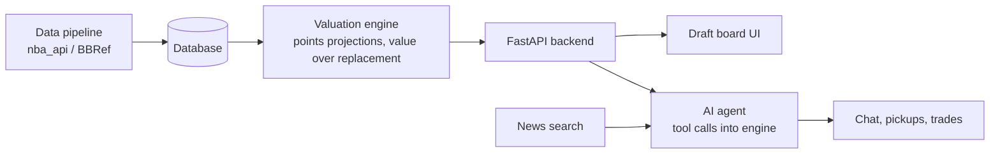

# Fantasy Basketball AI Assistant — Design Doc

Living version (edit and comment here, then sync this file): https://claude.ai/code/artifact/846efd64-3add-4c8c-86f6-7defe4274589

## Overview

We're building an AI assistant that helps fantasy basketball managers draft, pick up players, and evaluate trades. A deterministic stats engine does the math; an LLM agent reasons over its output and explains recommendations in plain language.

Primary user: us and our league-mates. Target: usable for 2026–27 season drafts in October, with pickups and trades added during the season.

## Goals and scope

The MVP is a draft assistant for one league format, usable in a real draft this October.

**MVP (in scope)**

- Player valuation for Yahoo points leagues: projected fantasy points per game, games played, and value over replacement
- Draft board: mark players as drafted, see best available for our roster
- Pick recommendation computed by the engine, explained by the LLM in one call
- Manual league setup (no platform login yet)

**Next (after MVP)**

- Pickup analyzer: agent scans free agents against roster needs, minutes trends, schedule, and news
- Trade analyzer: projected fantasy points impact of a proposed trade
- League sync via the Yahoo Fantasy API
- Daily proactive agent that alerts only when a move is worth making

**Non-goals for now**

- Multi-agent orchestration
- Category leagues and other platforms (after points works)
- Mobile app

## Open decisions

- [x] Platform: Yahoo
- [x] Scoring format: points
- [ ] Point values per stat: Yahoo defaults or our league's custom settings?
- [ ] Roster size, positions, number of teams, and any weekly games or transaction limits
- [ ] Data source: `nba_api`, Basketball Reference, or both
- [ ] Which LLM provider and model for the agent layer
- [ ] Frontend: simple web app (e.g. Streamlit or React) vs CLI for the first draft

## Architecture

Code does the math; the LLM decides and explains. The draft pick path is deterministic for speed; pickups and chat are agentic.

The agent calls engine functions as tools and loops until it can answer. During a live draft, the engine picks and the LLM only writes the explanation.

**Repo layout**

- `engine/` data pipeline, valuation, projections, backtests
- `app/` API, agent, prompts, UI
- `docs/` this design doc and the decision log
- `CLAUDE.md` shared context for both of our Claude sessions

## Interface contract

These functions are the boundary between the engine and the app. Changing a signature means updating this table in the same pull request.

| Function | Input | Returns | MVP? |
| --- | --- | --- | --- |
| `get_player_values` | league settings (point values per stat) | ranked players with projected fantasy points per game and value over replacement | Yes |
| `recommend_pick` | draft state (players taken), our roster, league settings | top N picks with value and roster-fit reasons (positions, games played) | Yes |
| `get_player_profile` | player id | season and recent stats, minutes trend, injury status | Yes |
| `find_pickups` | our roster, free agents, week | ranked pickups with reasons (need fit, minutes trend, games this week) | No |
| `evaluate_trade` | players out, players in, our roster | projected rest-of-season fantasy points before vs after | No |

**Shared data objects to define:** `LeagueSettings`, `Player`, `DraftState`, `Roster`. Until the engine is ready, the app uses mock versions that return the same shapes.

## Ownership and workflow

| Area | Owner |
| --- | --- |
| Data pipeline, database | Collaborator (data science) |
| Valuation model: points projections, value over replacement | Collaborator |
| Backtesting draft recommendations | Collaborator |
| AI agent: tools, prompts, reasoning | Varun |
| UI and UX (draft board, chat) | Varun |
| FastAPI backend, league integration | Varun |
| Interface contract, this doc | Both |

**How we stay in sync**

- The GitHub repo is the source of truth; nothing important lives only in a chat window.
- `CLAUDE.md` gives both of our Claude sessions the same project context.
- Tasks live in GitHub Issues with one owner each; work on branches, merge via pull requests the other person skims.
- Group chat for quick questions; one weekly call to demo progress and pick next tasks.
- Contract changes get flagged in the PR title.

## Milestones

The draft assistant needs to work before our league's draft date (open question: when is it?).

| Week | Collaborator | Varun |
| --- | --- | --- |
| 1 | Data pipeline pulls last season + current rosters | Repo, `CLAUDE.md`, mock engine, API skeleton |
| 2 | Points valuation model, value over replacement | Draft board UI against mock data |
| 3 | `recommend_pick` + backtest on last season | LLM explanation layer, wire to real engine |
| 4 | Fixes from a mock draft | Mock draft run end to end, polish |
| After draft | Minutes-trend model, `find_pickups` | Pickup agent, news tool |

## Decision log

| Decision | Why |
| --- | --- |
| Single agent with tools, not multi-agent | One agent with good tools is simpler and enough for these tasks |
| Draft pick is deterministic; LLM only explains | Speed and predictability under a pick clock |
| Build the draft assistant first | Draft season is October; pickups and trades reuse the same engine |
| Repo is the source of truth, with `CLAUDE.md` | Keeps both of our Claude sessions on the same page |
| Start with Yahoo points leagues | Most relevant format for us now; category leagues and other platforms come later |
